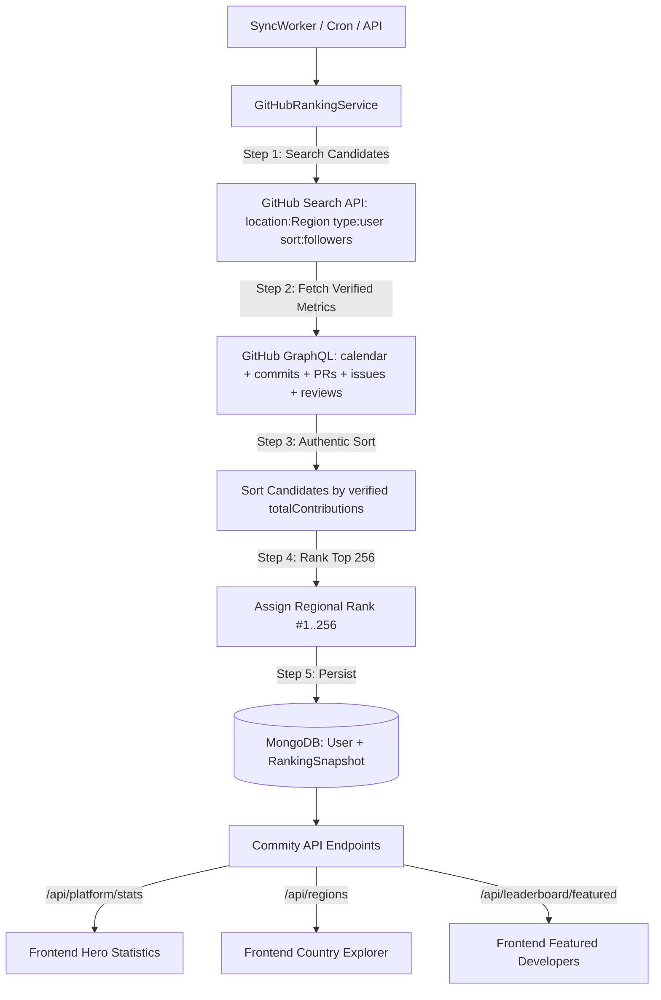

# Architectural Overhaul: Authentic GitHub GraphQL Ranking Engine & Dynamic Platform

## 1. Problem & Architecture Review
Commity previously relied on scraping `committers.top` HTML pages via regular expressions and invented fake statistics:
```javascript
// Previous fake estimates:
totalCommits: Math.round(item.contributions * 0.8)
totalPullRequests: Math.round(item.contributions * 0.15)
totalIssues: Math.round(item.contributions * 0.05)
```
In addition, hardcoded constants (`160760`, `69`) and hardcoded demo developers (`POPULAR_DEVELOPERS`, `topThree` fallback state) were embedded in both backend services and the frontend homepage.

### The New Architecture
Rather than scraping someone else's HTML or guessing commit counts with multipliers, Commity will implement the **authentic committers.top engineering architecture** directly against the GitHub API:
1. **Candidate Discovery**: Query GitHub API for individual developers in a region (`location:"${region}" type:user`), ordered by `followers` (because GitHub's Search API does not support sorting users by contribution count).
2. **GraphQL Field Retrieval**: Query GitHub GraphQL for the authentic, verified fields:
   - `contributionCalendar.totalContributions`
   - `restrictedContributionsCount`
   - `totalCommitContributions`
   - `totalPullRequestContributions`
   - `totalIssueContributions`
   - `totalPullRequestReviewContributions`
   - `followers`
3. **Regional Ranking & Snapshots**: Sort candidates by real `totalContributions` (`public + restricted`), assign regional ranks (Top 256), and save both individual verified `User` records and an immutable `RankingSnapshot` in MongoDB.
4. **Data-Driven Dynamic Frontend**: Replace static/hardcoded developer lists and hero counts in `frontend/app/page.js` with live data from new backend endpoints (`/api/platform/stats`, `/api/regions`, `/api/leaderboard/featured`).
5. **Methodological Transparency**: Disclose the candidate discovery process openly in the UI (followers discovery candidate pool -> contribution ranking).



---

## 2. Proposed Changes

### Phase 1: Kill Fake Data & Update User Schema
#### [MODIFY] [User.js](file:///Users/mc/CODING/GITHUB/WORKING%20REPO/Commity/backend/src/models/User.js)
- Add verification metadata fields:
  - `contributionSource`: `{ type: String, enum: ['github_graphql', 'github_rest', 'unverified'], default: 'github_graphql' }`
  - `dataQuality`: `{ type: String, enum: ['verified', 'estimated', 'unverified'], default: 'verified' }`
  - `statsUpdatedAt`: `{ type: Date, default: Date.now }`
- Remove all fallback calculations that invent numbers when fields are missing (store actual numbers or 0/null).

---

### Phase 2: Build Real `GitHubRankingService` & Sunset HTML Scraping
#### [NEW] [rankingSnapshot.js](file:///Users/mc/CODING/GITHUB/WORKING%20REPO/Commity/backend/src/models/RankingSnapshot.js)
- Mongoose model for immutable ranking snapshots:
  - `region`: String (e.g. `'Pakistan'`, `'United States'`)
  - `regionKey`: String (e.g. `'pakistan'`, `'usa'`)
  - `generatedAt`: Date
  - `totalUsersFound`: Number (from GitHub search total_count)
  - `minimumFollowers`: Number (lowest follower count among ranked candidates)
  - `candidatesConsidered`: Number
  - `usersRanked`: Number
  - `rankings`: Array of `{ rank, username, name, avatarUrl, contributions, commits, pullRequests, issues, reviews, followers }`

#### [NEW] [githubRankingService.js](file:///Users/mc/CODING/GITHUB/WORKING%20REPO/Commity/backend/src/services/githubRankingService.js)
- Replaces HTML-scraping `committersService.js`:
  - `discoverCandidates(region, maxCandidates = 100)`: Uses GitHub REST `/search/users?q=location:"${region}" type:user&sort=followers`.
  - `fetchCandidateContributions(candidates)`: Uses GitHub GraphQL query requesting real contribution collections (`totalCommitContributions`, `totalPullRequestContributions`, `totalIssueContributions`, `totalPullRequestReviewContributions`, `restrictedContributionsCount`, `totalContributions`).
  - `generateRegionalRanking(region, options)`: Discovers candidates, queries real GraphQL metrics, sorts candidates by `totalContributions` descending, upserts verified `User` documents, and persists a `RankingSnapshot`.

#### [MODIFY] [committersService.js](file:///Users/mc/CODING/GITHUB/WORKING%20REPO/Commity/backend/src/services/committersService.js)
- Delegate `syncRegion()` to `githubRankingService.js` so any existing callers seamlessly use the authentic GraphQL pipeline without HTML scraping or fake multipliers.

#### [MODIFY] [syncWorker.js](file:///Users/mc/CODING/GITHUB/WORKING%20REPO/Commity/backend/src/services/syncWorker.js)
- Call `GitHubRankingService.generateRegionalRanking('Pakistan')` during scheduled sync cycles.

---

### Phase 3: Backend API Expansion
#### [MODIFY] [leaderboardController.js](file:///Users/mc/CODING/GITHUB/WORKING%20REPO/Commity/backend/src/controllers/leaderboardController.js)
- Add `getFeaturedDevelopers`: Returns algorithmic top maintainers (top worldwide, top in key regions, top JavaScript/TypeScript/Python leaders).
- Add `getRankingSnapshots`: Returns historical regional snapshots.
- Add `getRegions`: Returns dynamic region metadata (active developer counts, top ranked quotas, flag emojis) aggregated live from MongoDB.

#### [MODIFY] [analyticsController.js](file:///Users/mc/CODING/GITHUB/WORKING%20REPO/Commity/backend/src/controllers/analyticsController.js)
- Enhance `getPlatformStats`: Return live verified numbers (`indexedDevelopers`, `indexedContributions`, `regionsCount`, `lastUpdatedAt`) computed from MongoDB.

#### [MODIFY] [leaderboard.js routes](file:///Users/mc/CODING/GITHUB/WORKING%20REPO/Commity/backend/src/routes/leaderboard.js) & [analytics.js routes](file:///Users/mc/CODING/GITHUB/WORKING%20REPO/Commity/backend/src/routes/analytics.js)
- Mount `GET /api/leaderboard/featured`
- Mount `GET /api/leaderboard/snapshots`
- Mount `GET /api/leaderboard/regions`
- Mount `GET /api/platform/stats` (alias in analytics/app)

---

### Phase 4: Dynamic Frontend (Kill Hardcoded Data)
#### [MODIFY] [page.js](file:///Users/mc/CODING/GITHUB/WORKING%20REPO/Commity/frontend/app/page.js)
- Replace static `POPULAR_DEVELOPERS` with live fetch from `/api/leaderboard/featured`.
- Replace static `COUNTRY_TABS` counts and highlights with dynamic data from `/api/leaderboard/regions`.
- Replace hardcoded hero numbers (`160,760+`, `100M+`, `12 users`) with live stats from `/api/platform/stats`.
- Replace hardcoded `topThree` fallback with real podium data from `/api/leaderboard?limit=3`.
- Add honest methodology tooltip/callout explaining the candidate discovery model.

---

## 3. Verification Plan

### Automated Tests
- Run `npm test` in `backend` to ensure all existing 14 tests pass and add unit tests for `GitHubRankingService`, `RankingSnapshot`, and new API endpoints.
- Run `npm run lint` in `frontend` to verify 0 lint errors.

### Live Functional Verification
- Verify `/api/platform/stats` returns live database metrics.
- Verify `/api/leaderboard/regions` returns dynamic region list.
- Verify `/api/leaderboard/featured` returns live featured developers.
- Verify frontend homepage loads dynamically with 0 hardcoded fallback numbers.
